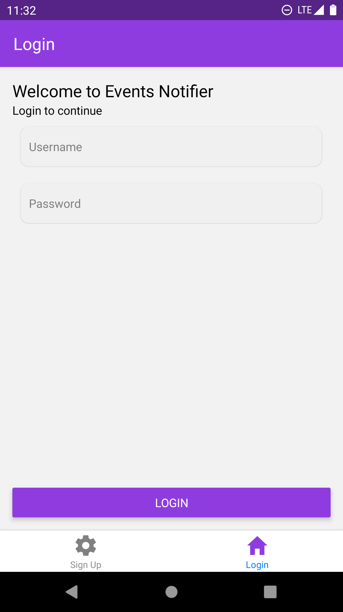
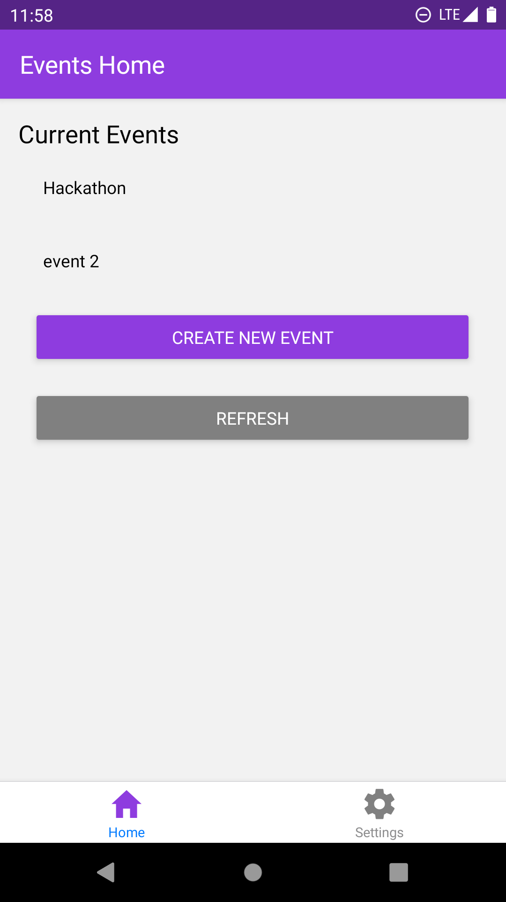
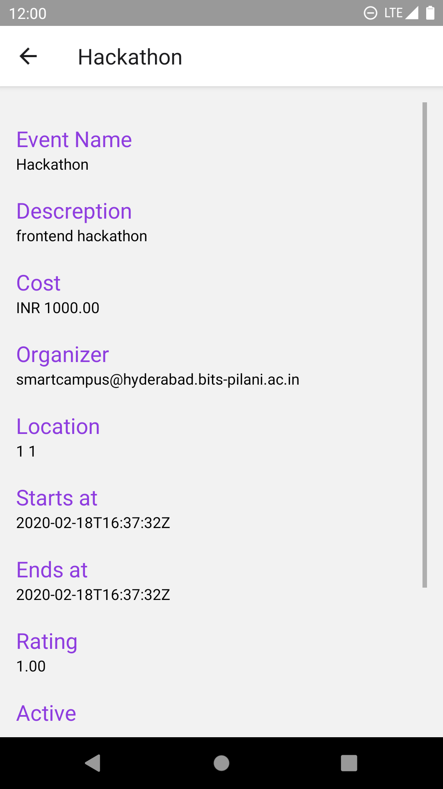
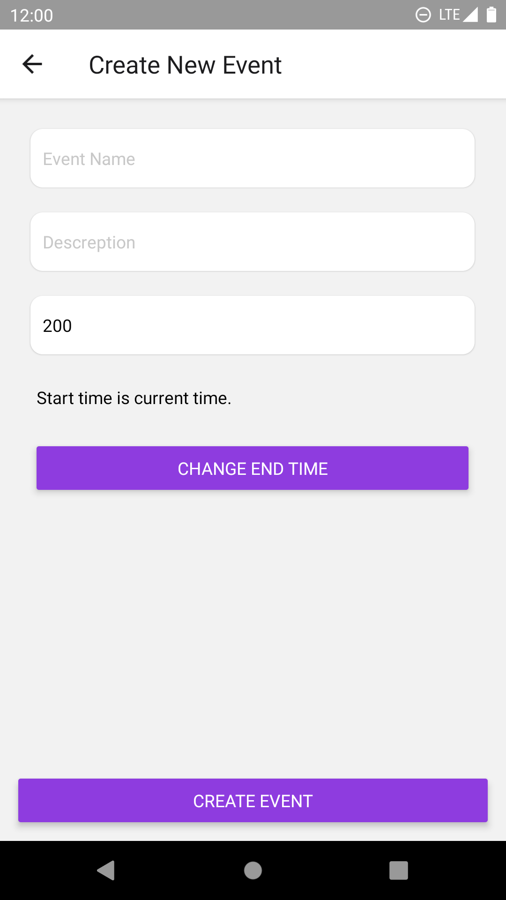
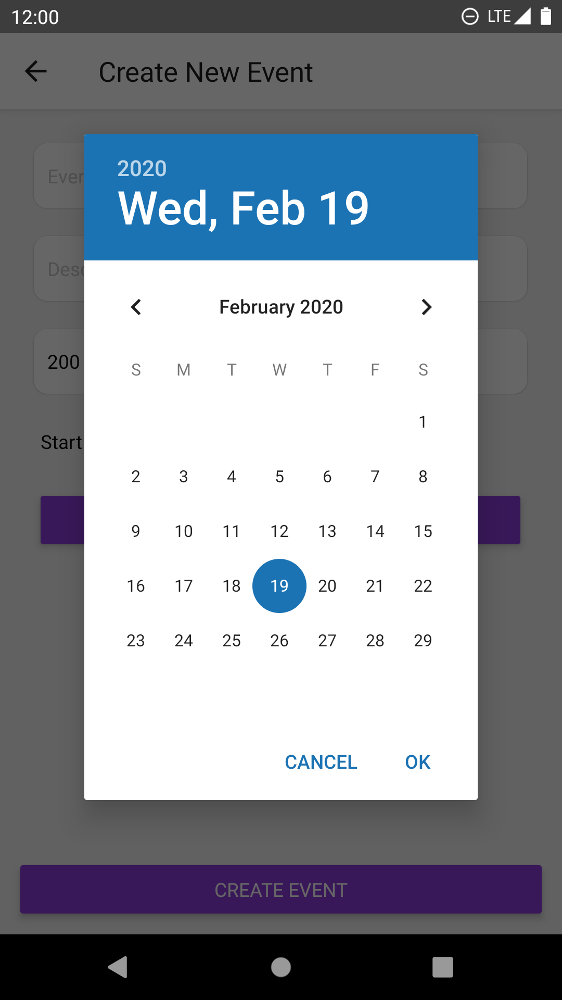

# Event notifier

Features:

- Auth based login
- Fetch events from server
- View event details
- Create New Events
- Redux based
- Automatic Persistance - every single app state change is saved for offline usage automatically.

## Screenshots











## Details

Uses mainly;

```
react native
react
redux
expo ( for management, to remove expo, use the 'expo eject' command )
[...]
```

and some other UI libraries etc.

## Run It

To run, execue `yarn start` and follow instructions. Contact me at `+91-9521738499` for help.
